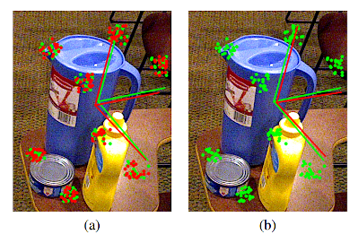
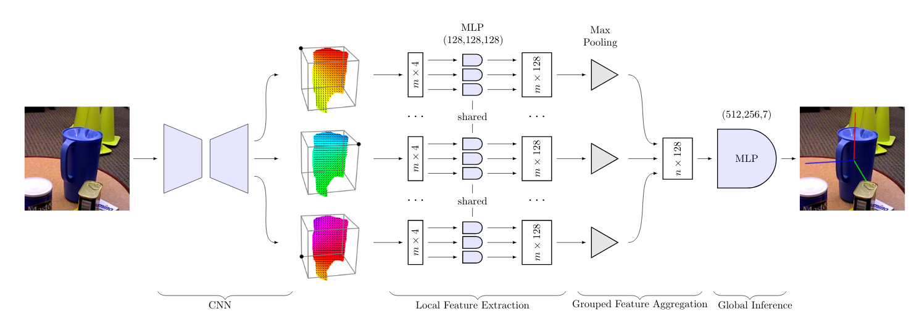

# Overview

This repository contains the code for the paper [**Single-Stage 6D Object Pose Estimation**](https://arxiv.org/abs/1911.08324). Yinlin Hu, Pascal Fua, Wei Wang and Mathieu Salzmann. CVPR 2020.

Most recent 6D pose estimation frameworks first rely on a deep network to establish correspondences between 3D object keypoints and 2D image locations and then use a variant of a RANSAC-based Perspective-n-Point (PnP) algorithm. This two-stage process, however, is suboptimal: First,  it is not end-to-end trainable. Second, training the deep network relies on a surrogate loss that does not directly reflect the final 6D pose estimation task.

In this work, we introduce a deep architecture that directly regresses 6D poses from correspondences. It takes as input a group of candidate correspondences for each 3D keypoint and accounts for the fact that the order of the correspondences within each group is irrelevant, while the order of the groups, that is, of the 3D keypoints, is fixed. Our architecture is generic and can thus be exploited in conjunction with existing correspondence-extraction networks so as to yield single-stage 6D pose estimation frameworks. Our experiments demonstrate that these single-stage frameworks consistently outperform their two-stage counterparts in terms of both accuracy and speed.

<p align="center">
  
</p>

Figure 1: Motivation. Consider the modern 6D pose estimation algorithm of [SegDrivenPose](https://arxiv.org/abs/1812.02541) that uses a deep network to predict several 2D correspondences for each of the eight 3D corners of the pitcher's bounding box. (a) Because it minimizes the average 2D error of these correspondences, two instances of such a framework could produce correspondences that differ but have the same average accuracy, such as the green and the red ones. As evidenced by the projected green and red reference frames, applying a RANSAC-based PnP algorithm to these two sets of correspondences can yield substantially different poses. (b) Even when using only the set of green correspondences, simply changing their order causes a RANSAC-based PnP algorithm to return different solutions.



Figure 2: Overall architecture for single-stage 6D object pose estimation. After establishing 3D-to-2D correspondences by some segmentation-driven CNN for 6D pose, we use three main modules to infer the pose from these correspondence clusters directly: a local feature extraction module with shared network parameters, a feature aggregation module operating within the different clusters, and a global inference module consisting of simple fully-connected layers to estimate the final pose as a quaternion and a translation. The color in the CNN outputs indicates the direction of the 2D offset from the grid cell center to the corresponding projected 3D bounding box corner.

# How to Use

This repository contains the code for the core network inferring pose from correspondences. It is straightforward to merge with other correspondence-extraction networks [SegDrivenPose](https://github.com/cvlab-epfl/segmentation-driven-pose) or [PVNet](https://github.com/zju3dv/clean-pvnet) to obtain an end-to-end 6D pose framework.

# Citing

```
@inproceedings{hu2020singlestagepose,
  title={Single-Stage 6D Object Pose Estimation},
  author={Yinlin Hu and Pascal Fua and Wei Wang and Mathieu Salzmann},
  booktitle={CVPR},
  year={2020}
}
```
